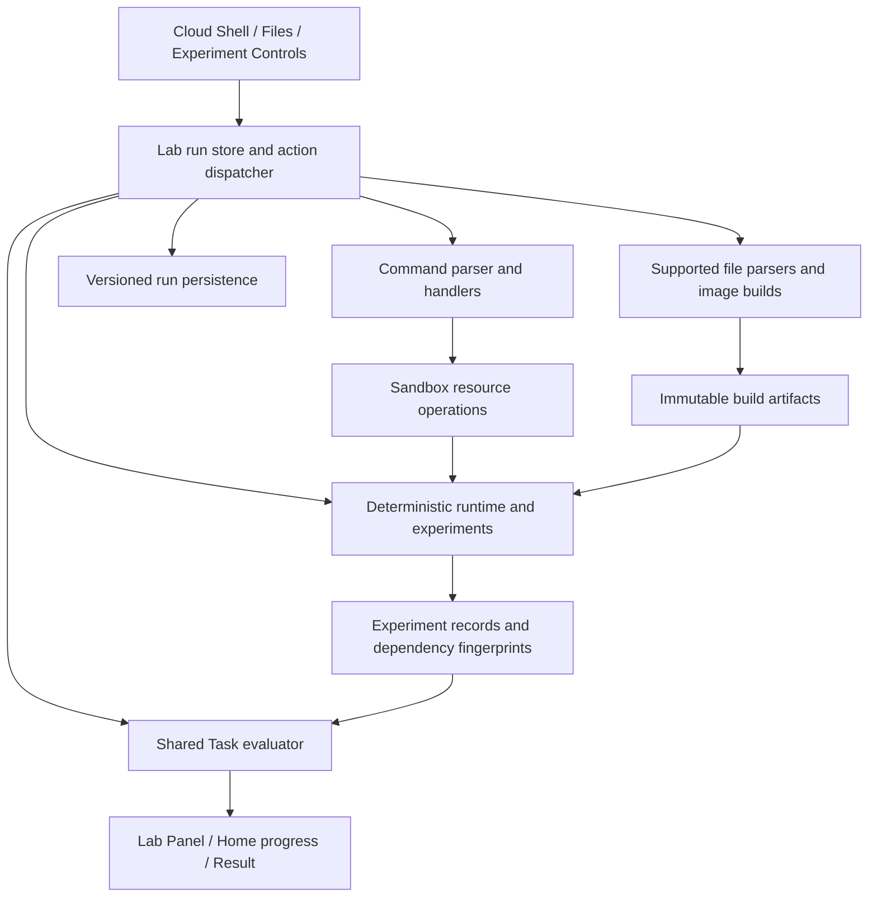

# Container Apps learning journeys: technical design

Date: 2026-09-22. Status: implementation design proposal; no application implementation is included in this document change.

Delivery status: the Guided, Troubleshooting and Independent deployment Labs, three CPU autoscaling Labs, all three health probes Labs, and all three Foundry integration Labs are implemented. Bicep and the Capstone remain planned.

Guided probes use the pinned [`Microsoft.App/containerApps@2025-07-01` probe schema](https://github.com/Azure/azure-rest-api-specs/blob/main/specification/app/resource-manager/Microsoft.App/ContainerApps/stable/2025-07-01/CommonDefinitions.json) for explicit HTTP fields. The local model accepts JSON-form YAML, records per-replica outcomes under an explicit one-second clock, and immediately restarts after sustained startup or liveness failure. It does not execute learner C#, infer omitted platform defaults, or claim Azure production timing. [Kubernetes semantics](https://kubernetes.io/docs/concepts/workloads/pods/probes/) support startup gating; [ACA health probe guidance](https://learn.microsoft.com/en-us/azure/container-apps/health-probes/) and [ACA-specific support evidence](https://azureossd.github.io/2023/08/23/Container-Apps-Troubleshooting-and-configuration-with-Health-Probes/) differ on readiness restart language, so the bounded readiness routing behavior is explicitly an exercise model.

Decision: [ADR-0002](../../adr/0002-behavioral-labs-with-bounded-local-simulation.md). Learning requirements: [agreed 16-Lab curriculum](2026-09-22-containerapps-learning-journeys-design.md).

## 1. Delivery contract

**Implement one Lab at a time. If that Lab needs shared building blocks, implement and verify the smallest prerequisite increment first, then finish that single Lab.** Do not batch the three Labs in a topic. Do not build all future infrastructure before delivering the first playable Lab. This rule comes from the user's explicit instruction, not an optional implementation preference.

Each increment has a bounded deliverable and verification gate. A prerequisite increment can be complete without a new playable Lab, but must demonstrate its behavior in focused tests. A Lab is complete only when its authored Tasks, Hints, Solutions, UI, failure cases, resume behavior, and end-to-end walkthrough have been verified. Review the completed increment before proceeding to the next; this is a delivery checkpoint, not a new permission prompt for every reversible action already authorized by a later implementation request.

This document fixes component contracts and delivery order. Create an executable task plan only for the next increment when implementation is requested; do not produce or execute a monolithic 16-Lab plan. Future Lab-specific values and SDK patch pins are defined in that Lab's plan, with source verification, before writing its implementation.

## 2. Current code and required extensions

| Existing surface | Observed behavior | Design response |
| --- | --- | --- |
| `src/lib/az/shell.js`, `run.js` | `runLine(sandbox, line)` accepts `az` and `clear`; handlers receive only Sandbox | Preserve this call form; add optional read-only execution context and optional operation effects for file/build/deployment commands |
| `src/lib/sandbox/model.js` | JSON-cloned resource arrays with additive normalization | Keep resource ownership here; add validators by resource family instead of growing one monolithic validator |
| `src/lib/sandbox/containerapps.js` | Stores image references and HTTP scaling settings; no running replicas | Extend configuration operations; introduce runtime simulation separately |
| `src/stores/labRun.js` | Tasks call `check(sandbox)`; completion requires every current check; generation guards delayed commands | Add a versioned run/evaluation adapter and one action dispatcher; retain generation cancellation |
| `src/stores/progress.js` | Recomputes progress with `check(sandbox)` and stores results in localStorage | Use the shared evaluator for new Labs; hydrate persisted version-2 summaries; preserve legacy records |
| `src/lib/az/commands/role.js` | Key Vault roles for the synthetic learner, with assignments nested inside each vault | Route by resource scope; keep the legacy Key Vault path while adding managed-identity assignments for new resource types |
| `src/pages/LabPage.vue` | Resource Blade, Cloud Shell, right-hand Lab Panel | Add Files and Experiments as Lab tools; retain the existing Blade layout and read-only resource inspection |
| `TaskRow.vue`, `LabPanel.vue` | A Solution is one string; Task UI has current/pending/done states | Support worked file/command/experiment steps and a visible needs-verification state |
| `src/data/labs/index.js` | Six existing Labs; catalog order controls progression | Preserve IDs/order/results; add the journey incrementally and activate only verified Labs |

Existing tests frequently execute `task.solution` directly and call `task.check(sandbox)`. Do not force those Labs into the new file/experiment model or rewrite all existing content to make the new engine fit.

## 3. Architecture and ownership



The Pinia store owns the active run and serializes actions; UI components never mutate resources, artifacts, or evidence directly. Resource operations remain pure functions that return a next Sandbox. Simulation operates on a separate runtime projection inside the run; configured replica bounds and observed live replica counts are distinct.

Proposed interfaces are contracts, not code to scaffold in this documentation task:

| Interface | Responsibility |
| --- | --- |
| `createBehavioralRun(lab)` | Seed resources, files, runtime, identifiers, and empty evidence for a new attempt |
| `applyRunAction(run, action, lab)` | Return `{ run, lines, portalEvents, diagnostics }` from one supported command, file save, experiment action, or stage transition |
| `evaluateLab(lab, run)` | Pure calculation of Task status, reason, evidence IDs, and completion eligibility |
| `advanceSimulation(run, seconds, lab)` | Advance bounded simulated time; emit probe/scaling/request events and scenario measurements |
| `parseProject(files, manifest)` | Return a supported application specification and diagnostics without executing C# |
| `compileDeployment(files, entryPath, parameters, sandbox)` | Return a typed deployment graph and diagnostics for the supported Bicep subset |
| `saveBehavioralRun(run)` / `loadBehavioralRun(labId)` | Versioned persistence with surfaced failures |

Create each module only when its first consumer is implemented. Do not introduce an event bus, backend server, generic plugin framework, or arbitrary execution engine.

## 4. Versioned run and resource model

New Labs declare `engineVersion: 2`, `contentVersion`, `journeyId: 'containerapps-end-to-end'`, `journeyOrder`, and `labMode` (`guided`, `troubleshooting`, `independent`, or `capstone`). Existing Labs without `engineVersion` use the legacy adapter.

A version-2 run contains:

```text
schemaVersion: 2
labId, contentVersion, attemptId, nextSequence
sandbox: existing resource collections plus additive resource families
project: { manifestId, savedFiles, draftFiles, fileVersions, diagnostics }
artifacts: { buildsById, publishedTags, sourceSnapshotsByHash }
runtime: { simTimeMs, deploymentsByApp, replicasByApp, activeScenario, scheduledEvents }
evidence: { experimentsById, currentEvidenceByTask, milestoneRecords }
stages: { activeStageId, sealedStages, cleanupCheckpoint }
scrollback, history, hintsRevealed, solutionsRevealed, elapsedMs
completedAt, resultId
```

No functions, browser handles, access tokens, or real credentials are persisted. Resource references use canonical synthetic ARM IDs, with case-insensitive comparisons matching existing operations. IDs inside an attempt are deterministic monotonic sequences; `attemptId` identifies the attempt, so an ID from another Lab/run cannot satisfy a Task.

Add `containerRegistries` and `managedIdentities` for Lab 1; add `foundryAccounts` and model deployments for Lab 10. Add a new top-level `roleAssignments` collection for the new resource scopes while keeping existing Key Vault assignments in their original location. The role command router dispatches Key Vault operations to existing logic and new scopes to the new identity module. No broad Key Vault migration is required.

Use user-assigned managed identity for the initial image-pull path, making it possible to create the identity and grant access before app creation. Identity `resourceId`, `clientId`, and `principalId` are distinct. An attached identity alone grants no permission. Initially support exact-resource scopes, non-ABAC ACR with `AcrPull`, and the selected Foundry inference role; explicitly reject unsupported scope/role combinations. The synthetic learner retains provisioning authority in the Lab; that is separate from the application's runtime permissions.

Deleting an app removes its runtime projection and invalidates relevant evidence. Deleting a registry or identity makes later dependent pulls/access fail; it must not magically terminate an already running container. Keep the artifact captured by that running deployment until it is no longer referenced. Preserve existing Container Apps environment dependency guards. Group cleanup removes resources owned by that group and validates the existing cross-group environment constraints before applying removals; external references must never cause unrelated resources to be silently deleted.

## 5. File editor and bounded application interpretation

Use the current Vue stack and an accessible textarea-based code editor initially. Avoid adding an IDE dependency before the first Lab establishes a need. Provide a file tree, editable regions, Save, diagnostics with path/line/column, and a visible distinction between saved source, published image, and deployed version.

The starter targets **.NET 10 / ASP.NET Core Minimal APIs**, which is an active LTS family at the design date. The learner's C# files are teaching artifacts; the trainer itself remains JavaScript. See the [.NET support policy](https://dotnet.microsoft.com/en-us/platform/support/policy/dotnet-core).

Starter manifest:

| File | Supported learning edits |
| --- | --- |
| `src/Trainer.Api/Trainer.Api.csproj` | Target framework and declared dependencies shown; most structure fixed |
| `src/Trainer.Api/Program.cs` | Recognized route registrations, response expressions, and later health/inference integration regions |
| `src/Trainer.Api/AppSettings.cs` | Typed constants for service name, processing mode, and supported behavior settings |
| `src/Trainer.Api/appsettings.json` | Validated known settings with documented types |
| `Dockerfile` | Supported .NET multi-stage build, published output path, runtime image, listening-port environment, and entrypoint |
| `.dockerignore` | Fixed starter exclusions in the initial Lab |
| `infra/*.bicep`, `infra/modules/*.bicep`, `infra/*.bicepparam` | Introduced when Bicep Labs need them |

Do not use substring searches to declare arbitrary source correct. A manifest identifies editable regions and fixed scaffolding. Tokenize supported regions, parse literals/member access/object initializers and recognized route/health/client patterns, and produce an `AppSpec`. Normalize irrelevant whitespace/comments. Permit alternative supported expressions that produce the required behavior; report unsupported syntax separately from syntax/type errors. Unknown executable statements cannot be ignored while the build claims success.

`AppSpec` represents route methods/paths, response contracts, configuration lookups, listening port, and later CPU/health/inference policies. It is derived from source and configuration, not from a hidden setting that can bypass the learner's edits. Each supported pattern needs positive, negative, and semantically equivalent examples.

Lab 1's initial contract is `GET /api/info`, returning 200 with `service` from the supported C# setting and `environment` from deployed `APP_ENV`. The Guided fixture uses `service = "contoso-api"`, `APP_ENV = "training"`, and listening/target port 8080. The Independent deployment Lab changes these values and the port. This provides observable source and runtime-configuration checks before introducing CPU, health, or inference behavior.

Save updates the project version and diagnostics. Build commands read saved files; unsaved drafts remain visibly marked and never silently enter a build. All paths are normalized relative virtual paths within the run. Reject traversal, absolute paths, URLs, and unknown files. Initial budgets: 32 KiB per editable file, 256 KiB for saved project text, 32 files, and 5,000 lexer tokens per edited region; report limits before mutation.

## 6. Image and deployment lifecycle

Use the simulated **`az acr build --registry <name> --image <repository>:<tag> --file Dockerfile .`** workflow. The command validates the saved build context, creates an immutable build artifact, and publishes its tag to the simulated registry on success. Publishing is part of this command; do not teach that an additional Docker push is required after a successful ACR build. Unsupported build flags/remote contexts are rejected. [ACR command reference](https://learn.microsoft.com/en-us/cli/azure/acr?view=azure-cli-latest#az-acr-build)

A build artifact includes its source hash, supported `AppSpec`, Dockerfile interpretation, synthetic digest, build ID, and diagnostics. The digest is a deterministic simulation identifier, not a real OCI image digest. A tag resolves to an artifact; retagging/rebuilding does not rewrite artifacts already captured by a running deployment.

An app deployment resolves registry/tag or digest, verifies image-pull identity access, and captures the resolved artifact plus effective environment, ingress, resources, probes, scaling, and identity configuration. Store desired configuration separately from active runtime deployment. A failed first deployment remains visible with a failed provisioning/activation reason and receives no traffic. A failed update preserves the previous active deployment and its evidence until a replacement becomes active; Tasks can require the desired version, so an old working app cannot satisfy a requested update.

Basic immutable deployment generations are necessary; multi-revision traffic splitting remains outside scope. Display an explicit simulated deployment version and avoid pretending it implements Azure's entire revision lifecycle. Changes to resource template fields activate a new simulated deployment; runtime environment changes are also versioned for evidence even where real Azure treats them as app-level changes.

Authentication revocation does not magically stop a container that already pulled an image. It prevents a later pull/start that requires access. Inference permission changes affect subsequent inference requests. Evidence dependencies must respect this distinction.

Extend the existing `containerapp` commands with only the flags required by the active Lab, including matching ingress/port updates and managed identity/registry settings. Add `acr`, `identity`, and generalized role-scope routing for Lab 1. Resource/error output should remain Azure-shaped; simulation-specific diagnostics must be clearly labeled. [Managed-identity image pull](https://learn.microsoft.com/en-us/azure/container-apps/managed-identity-image-pull)

## 7. Command and experiment dispatch

Preserve `runLine(sandbox, line)` and `runAz(sandbox, tokens)` for old callers. New calls may supply a third, read-only context containing saved project files, artifact/runtime views, active Lab capabilities, and simulated time. Command handlers still return the next Sandbox; file/artifact/runtime changes travel as explicit typed effects that the version-2 dispatcher applies. Add these optional fields through the shell/run layers without dropping them during formatting.

The dispatcher validates all effects before commit. Parser/validation failures do not mutate resources or publish artifacts. Simulated deployment execution failures may intentionally retain provisioned resources and a failed deployment record; do not represent real deployments as universally transactional. Such failures must remain inspectable and must not produce success evidence.

Serialize commands, file saves, and experiment advancement. While an action is active, disable conflicting mutation controls. Use the existing generation guard plus attempt ID to discard late work after Restart or navigation. A rejected action may add diagnostics/history but cannot award evidence. Keep UI animation latency separate from modeled simulation time.

Experiment Controls are trainer actions, not invented Azure CLI commands:

- Send a request: select a Lab-owned app, method/path, and supported request body.
- Run a named workload/fault scenario: immutable scenario parameters come from the Lab manifest.
- Inspect free-form supported load/fault settings: useful for practice, but cannot substitute for a required verification scenario.
- Advance/pause simulated time and inspect the event timeline.

Changing configuration aborts an in-progress verification experiment; partial samples cannot pass. Practice load controls do not silently alter a graded scenario. The simulation advances only while requested, never because a browser tab was left unattended or a saved run was reopened.

## 8. Deterministic simulation contracts

Use a one-second base tick, seeded identifiers, and a stable event order: apply scheduled faults, evaluate startup/liveness, update readiness, route requests and record inference attempts, collect interval measurements, then make scaling decisions. Model times are accelerated teaching time and displayed as such. Wall-clock study duration remains separate.

### HTTP behavior and CPU scaling

Only healthy/ready replicas of the active simulated deployment receive new requests. Route deterministically round-robin for testable traces. A target-port mismatch or lack of ready replicas yields an explicit simulated ingress failure; do not pretend the request ran application code.

For CPU scenarios, define work demand in CPU-seconds per simulated second and per-request cost in the workload fixture. Allocation is per-replica requested CPU. The simplified utilization is the average measured busy CPU divided by requested CPU, capped at the modeled capacity. Every 15 simulated seconds use `ceil(currentReplicas * utilization / targetUtilization)` clamped to configured bounds, with a 10 percent tolerance. Scale-in requires 60 seconds of sustained lower demand; this is a stated teaching simplification, not an Azure default. Newly added replicas must become ready before serving requests.

The Guided fixture uses minimum 1, maximum 5, target 60 percent, and 0.5 vCPU per replica. Demand phases are 0.1 CPU-seconds/second at baseline, 0.8 sustained, 4.0 overload, then zero. Require more than one ready replica under sustained demand, observe the ceiling during overload without claiming all demand is served, and return to 1 after stabilization. Independent fixtures change demand and constraints and accept multiple configurations. Pair supported CPU/memory allocations from an explicit manifest; arbitrary resource combinations cannot pass validation.

CPU Troubleshooting begins 30 simulated seconds into a real 0.8 CPU-seconds/second scenario on a healthy private API capped at one 0.5 CPU replica. The learner can inspect the 100% CPU and 40 offered versus 25 served illustrative requests per second, then raise the maximum within the stated limit of five. Recovery requires a fresh completed 90-second run with more than one ready replica and full service in every final 15-second sample; a separate zero-demand run must scale from above the minimum back to one. Scaling and captured deployment changes invalidate earlier proof.

CPU Independent starts with the same healthy private API pattern and no active workload or scale rule. It accepts 0.5 CPU/1Gi or 1 CPU/2Gi, a minimum of one, a maximum no higher than four, and one CPU Utilization rule with any supported target. Its 90-second Steady and Burst fixtures offer 0.9 and 1.8 CPU-seconds/second, or 30 and 60 illustrative requests per second at 0.03 CPU-seconds each. Both must serve all offered throughput throughout the final 15 seconds; Burst must end with more than one ready replica. Steady and Burst may pass in either order, then a 90-second Quiet fixture must begin above the minimum and end at one. Quiet evidence binds the latest successful load proofs, so a later load run requires a new Quiet run. Multiple measured configurations satisfy the same requirements.

CPU-only Labs reject a zero minimum as incompatible with their stated requirements; this is a Lab constraint, not a claim that the Azure API universally rejects that setting. Model CPU waiting separately from Foundry network latency. Keep the old HTTP configuration Lab intact. [Azure scaling tutorial](https://learn.microsoft.com/en-us/azure/container-apps/tutorial-scaling)

### Probe behavior

Support explicit HTTP probes with path, integer port, initial delay, period, timeout, and failure threshold; readiness additionally supports a recovery success threshold. Startup/liveness success threshold remains 1. Validate against the selected Container Apps schema before the first probe Lab; unsupported probe transports/types are clearly identified.

Startup gates other probe checks until success. Readiness excludes a replica from traffic without itself restarting it. Sustained liveness/startup failure restarts the container and begins startup again. Initial deterministic fixture: two replicas, 20-second startup, startup checks every 5 seconds with six allowed failures, and liveness/readiness checks every 5 seconds with failure threshold 2. Independent briefs impose maximum detection/recovery windows, preventing unlimited thresholds from passing.

Record probe type, endpoint status, elapsed time, readiness, restart cause/count, and routed requests. A dependency outage and an unresponsive local process are different fixtures. Only the process hang is cleared by restart. Do not fix a persistent downstream outage by restarting the app.

Microsoft's health-probe article contains an ambiguous readiness/restart sentence. Use the explicit Kubernetes probe semantics for the teaching model, label platform simplifications, and verify the ACA-specific schema and behavior before shipping Lab 7. If authoritative ACA behavior contradicts this contract, amend the technical design and affected fixtures before implementation rather than presenting an unverified Azure claim. [ACA probes](https://learn.microsoft.com/en-us/azure/container-apps/health-probes), [Kubernetes probe semantics](https://kubernetes.io/docs/tasks/configure-pod-container/configure-liveness-readiness-startup-probes/)

### Foundry integration

Select a Foundry account (`AIServices`) with a project for setup context and resource-level model deployments. Use the resource endpoint `https://<resource>.services.ai.azure.com/openai/v1/` and Responses API, not the project/agent endpoint. The C# teaching client uses `OpenAI` and `Azure.Identity`, token scope `https://ai.azure.com/.default`, and `Cognitive Services User` on the Foundry resource for the app identity. Pin compatible SDK package versions and resource API versions in Lab 10's template manifest; exercise endpoint selection, deployment names, and identity checks as one coherent combination. These choices follow the current [Microsoft keyless example](https://learn.microsoft.com/en-us/azure/foundry/foundry-models/how-to/configure-entra-id).

Model profiles are bundled supported fixtures, not a live catalog/region-availability claim. The account/project/deployment setup and endpoint names are synthetic; credentials are represented by attached identities and permission checks, never by real token acquisition. The model response is a deterministic fixture selected from request content and deployment profile, visibly labeled simulated.

Use explicit states for bad deployment selection, missing identity, missing role, transient 429, persistent 429, timeout, and success. Labs 10–11 use `POST /api/summarize`: invalid input returns 400 without an inference event; healthy input returns 200 with summary and deployment; exhausted dependency availability returns 503; timeout returns 504. Lab 12 adds the bounded `brief-v1` contract at `POST /api/brief`, accepting `{content}` and returning `{brief,deployment}` on success. Keep diagnostic upstream status distinct from the public API response.

The Labs 10–11 initial retry policy allows three total attempts, a 10-second overall request deadline, and up to 3 seconds per attempt. Lab 12 accepts two or three attempts with a five- through eight-second overall budget and one- or two-second attempt cap, as bounded in its implementation plan. Honor a supplied Retry-After if a next attempt fits the remaining budget; otherwise use deterministic 1-second then 2-second fallback delays. Without that header, use the same fallback delays. Return 504 if even the fallback and next attempt cannot fit the overall deadline. Disable additional SDK retries in the authored snippet so there is one retry owner. Never retry missing permissions or invalid deployment selection. Scenario traces record attempts, delays, caller, deployment, correlation ID, and final result.

## 9. Bicep subset and deployment provenance

Introduce Bicep only immediately before Lab 13. Implement a lexer/parser and typed intermediate representation, not text replacement or JavaScript evaluation. Initial support:

- Resource-group deployment scope, incremental mode, local `.bicep` modules, and `.bicepparam` files with `using` and literal parameter assignments.
- String/int/bool/object/array parameters, defaults, simple `@description`/`@allowed`/`@minValue`/`@maxValue` decorators, variables, object/array literals, string interpolation, resource declarations, existing resource references, outputs, module parameters, and resource/module-output references.
- A small pure function allowlist: `resourceGroup()`, `subscription()`, `resourceId()`, `guid()`, and `uniqueString()`, restricted to the shapes used in the templates. Verify deterministic function compatibility before fixtures depend on names derived from them; report unsupported argument shapes explicitly.
- Resource handlers for ACR, user-assigned identities, Container Apps environments/apps, resource-scoped role assignments, Foundry accounts/projects/model deployments. Pin stable supported resource API versions in the manifest of the first Bicep Lab.

Reject cycles, missing module/output/parameter references, wrong types, path traversal, unsupported functions/resources, loops/conditions not implemented by this subset, remote module registries, deployment scripts, and subscription/tenant deployment scopes. Unsupported valid Bicep is distinct from invalid syntax. Source diagnostics must include file and location.

`compileDeployment` produces a dependency graph and effective desired resources. Infer dependencies from references; support explicit `dependsOn` for supported resources. An `existing` declaration resolves a resource without creating it. Role assignments must be applied before an app activation requiring those permissions.

`validate` checks syntax/types/schema and known dependencies without mutation. `what-if` compares the supported desired graph to the current target and reports create/modify/no-change/ignored-existing, also without mutation. `create` executes the graph through the same resource operations used by CLI commands and records the source hash, parameter hash, target scope, deployment ID, operations, and outputs. Keep partial deployment failures inspectable. Do not delete omitted resources in incremental mode.

Bicep Tasks require current deployment provenance plus runtime evidence. A manual CLI fix may help diagnose, but cannot complete the authoring Task until corrected files reproduce it. Changing files/parameters makes a prior required preview stale. A no-op redeployment with equal effective configuration must not invalidate unrelated behavioral evidence merely because the deployment history ID changed.

A main template does not build an image. In the capstone, use `infra/bootstrap.bicep` for registry/identity foundations, publish the image, then `infra/main.bicep` for the application stack. Both share local modules and explicit outputs. [Modules](https://learn.microsoft.com/en-us/azure/azure-resource-manager/bicep/modules), [parameter files](https://learn.microsoft.com/en-us/azure/azure-resource-manager/bicep/parameter-files), [what-if](https://learn.microsoft.com/en-us/azure/azure-resource-manager/bicep/deploy-what-if)

## 10. Verification, milestones, and completion

Use one evaluator for the Lab Panel, Home summaries, and result creation. Legacy Tasks remain `check(sandbox)`. New Task definitions declare a predicate over `{ sandbox, project, artifacts, runtime, evidence, stages }`, `kind` (`configuration`, `artifact`, `experiment`, `deployment`, or `cleanup`), dependency selectors, stage ID, and retention (`live` or `milestone`).

Evaluation returns `pending`, `needs-verification`, or `done`, plus a reason and evidence IDs. Current-task highlighting is independent of status. A prior pass with invalidated evidence becomes needs-verification; a Task that has never passed remains pending. An experiment record contains attempt/Lab/scenario IDs and versions, effective inputs, start/end simulated time, selected dependency fingerprints, measurements, outcome, and failure reasons. Only completed named verification scenarios can satisfy their Tasks.

Fingerprint canonical semantic inputs, not every mutation or whole-run JSON. Ignore tags and unrelated resources. Include the relevant image behavior, effective app settings, probe/scaling policy, attached identity, scope-specific authorization generation, and fixture version. A configuration that is changed away and back still needs a fresh run where its dependency generation changed. Source draft edits do not invalidate runtime evidence for an unchanged deployment; file/build Tasks can independently become incomplete.

Record invalidation dependencies at field-group granularity, so a scaling-only change invalidates scaling verification without needlessly clearing an unchanged Foundry request result. A source/image change conservatively invalidates application-behavior evidence; a Foundry role change invalidates inference evidence. If a deployment is a true semantic no-op, preserve evidence.

Stage milestones capture proof of historical actions such as building/publishing an image. They do not imply the current API is still healthy. At the final operational gate, require every live criterion and prescribed recovery experiment to pass, then seal an immutable pre-cleanup checkpoint. In cleanup stage, only deletion/inspection actions preserve that seal; a new deployment, configuration edit, or experiment that changes operating conditions reopens the operational gate. Premature deletion cannot seal it. The cleanup Task checks all Lab-owned resources are gone, including partially created resources; shared seeded fixtures are handled by explicit ownership flags. Stage seals retain prior successful scenario milestones, so a later fault experiment cannot erase the earlier required healthy/scale-out demonstration; the final gate nevertheless requires a fresh post-repair verification of every affected live criterion.

Only the capstone mandates final cleanup in this initial journey. Topic Labs finish after verification and retain resources for inspection; restarting discards their Sandbox. All new Labs freeze a completed attempt as read-only inspection, preserving its Result; Restart creates a fresh attempt. Legacy completion behavior remains compatible until independently changed.

Solutions become `{ steps: [{ kind: 'command' | 'file' | 'experiment', ... }] }` for new Labs; old string Solutions remain supported. File steps show exact path/content, experiment steps identify controls and expected observation, and revealing help never executes a step or grants a Task pass.

## 11. Persistence and compatibility

Keep existing `at_run_<labId>` and `at_results` localStorage data untouched for legacy Labs. New runs contain files, artifacts, and evidence that exceed the suitability of the current best-effort localStorage wrapper. Use native IndexedDB database `azure-trainer-behavioral`, version 1, with `runs` keyed by lab ID and `results` keyed by result ID. No external persistence dependency is required.

Save the active run as one versioned aggregate; deduplicate source snapshots by content hash inside it. A completion transaction atomically writes the completed run and immutable result. Hydrate new-Lab summaries from IndexedDB on Home, merge result views by stable ID with legacy localStorage results, and show a loading state until hydration completes. Do not silently report unhydrated Labs as not started.

Keep at most 500 detailed runtime events and 600 shell lines; preserve compact evidence summaries and referenced scenario measurements independently of this ring buffer. Keep the active/last successful and failed build diagnostics plus artifacts referenced by deployments/evidence; prune only unreferenced artifacts. Warn on storage failure and show that the latest changes are unsaved. Provide export of a run as JSON and retry saving; never clear unrelated data to recover quota.

Schema migration is pure and versioned. Missing `engineVersion` identifies legacy content, not an invalid version-2 run. Newer unsupported schema/content versions must not be overwritten: offer export and explicit restart. Corrupt records remain recoverable/exportable; reset only the selected Lab after user action. For compatible content changes preserve state; for changed acceptance fixtures mark only affected evidence stale. No partial-load path may fabricate a completed Task or rewrite historical results.

The active run commits after successful actions and when drafts change. Debounce draft persistence with a visible saved/unsaved indicator; flush on in-app navigation. On reload, pause scenarios at the saved tick and discard animation locks, preserving committed measurements. Persist a small pending-operation marker before starting an animated build/deployment; on successful commit clear it in the same transaction. Reload with that marker restores the last committed state and labels the interrupted action without granting its effects or evidence.

Use a persisted run revision and compare-and-swap saves within IndexedDB transactions. If another browser tab has advanced the same Lab attempt, the stale tab becomes read-only until it reloads; it must not overwrite newer evidence or results. Completion is idempotent by attempt/result ID, preventing duplicate Lab Results after retry or reload.

## 12. File/component boundaries

These are target locations; create only those required by the current increment.

| Location | Responsibility / first use |
| --- | --- |
| `src/lib/labEngine/run.js`, `evaluate.js`, `evidence.js` | Version-2 run actions, pure evaluation, fingerprints; foundation |
| `src/lib/labEngine/persistence.js`, `migrations.js` | IndexedDB and schema/content migration; foundation |
| `src/lib/project/files.js`, `csharp.js`, `dockerfile.js`, `build.js` | Saved file versions, bounded parsers, immutable artifacts; Lab 1 prerequisites |
| `src/lib/sandbox/registry.js`, `identity.js`, `roleAssignments.js` | New resource operations; Lab 1 prerequisites |
| `src/lib/simulation/runtime.js`, `requests.js` | Deployment activation and simple request evidence; Lab 1 prerequisites |
| `src/lib/simulation/scaling.js` | CPU workload/time model; Lab 4 prerequisite |
| `src/lib/simulation/probes.js` | Per-replica probe lifecycle; Lab 7 prerequisite |
| `src/lib/sandbox/foundry.js`, `src/lib/simulation/inference.js` | Resources, model request/identity/failure model; Lab 10 prerequisite |
| `src/lib/bicep/lexer.js`, `parser.js`, `evaluate.js`, `deploy.js` | Bounded module compilation and deployment; Lab 13 prerequisite |
| `src/lib/az/commands/acr.js`, `identity.js`, later `cognitiveservices.js`, `deployment.js` | CLI adapters and help for implemented capability slices |
| `src/components/lab/ProjectEditor.vue`, `ExperimentPanel.vue`, `EvidenceDetails.vue` | Lab tools; introduce basic forms first, add controls per Lab |
| `src/data/templates/containerapps-dotnet/` | Versioned authored starter files and parser manifest |
| `src/data/labs/containerapps-journey/` | One definition per delivered Lab; topic fixtures shared only when needed |

Modify `labRun.js`, `progress.js`, `LabPage.vue`, `LabPanel.vue`, `TaskRow.vue`, and `LabCompletePanel.vue` through adapters. Update `BladeHost.vue`, resource groups, `bladeResolve.js`, and `portal.js` when adding a resource type so inspection and deletion navigation remain consistent. Avoid mixing runtime simulation into the generic CLI tokenizer or Vue components.

## 13. Incremental delivery sequence

The first increment is **F0: versioned run, evaluation, and persistence foundation**. Scope: the version-2 run schema, legacy evaluator adapter, evidence identity/invalidation primitives, IndexedDB save/resume, and generation cancellation. Verify with a tiny internal fixture; do not add a public Lab, C# parser, CPU model, probe model, Foundry, or Bicep in F0.

Next is **F1: Lab 1 prerequisites**: bounded project saving/parsing, simulated ACR build/publication, registry and user-assigned identity resources, exact-scope image-pull access, deployment snapshots, and a simple request experiment. Split F1 further if needed into independently verifiable prerequisites, all justified by Lab 1. Then deliver **Lab 1 only**, with its complete learning UI and walkthrough.

| Next playable Lab | Stable proposed ID | Just-in-time prerequisite |
| --- | --- | --- |
| 1. Guided deployment | `aca-deploy-guided` | F0 and F1 |
| 2. Deployment troubleshooting | `aca-deploy-troubleshooting` | Missing-tag/access/port failure diagnostics |
| 3. Independent deployment | `aca-deploy-independent` | Requirement-based grading for supported variations |
| 4. Guided CPU scaling | `aca-cpu-guided` | Clock/workload/scaling model and metrics |
| 5. CPU troubleshooting | `aca-cpu-troubleshooting` | Fixed overload incident and same-workload recovery checks |
| 6. Independent CPU scaling | `aca-cpu-independent` | Alternative valid configuration fixtures |
| 7. Guided probes | `aca-probes-guided` | Probe model, endpoint edits, fault controls, verified ACA contract |
| 8. Probe troubleshooting | `aca-probes-troubleshooting` | Restart-loop and dependency-coupling fixtures |
| 9. Independent probes | `aca-probes-independent` | Bounded reliability-brief checks |
| 10. Guided Foundry API | `aca-foundry-guided` | Pinned Foundry integration, model/identity/request model |
| 11. Foundry troubleshooting | `aca-foundry-troubleshooting` | Retry/deadline fixtures and diagnostic traces |
| 12. Independent Foundry API | `aca-foundry-independent` | API-contract and alternate deployment fixtures |
| 13. Guided Bicep | `aca-bicep-guided` | Bounded parser, graph deployment, preview/provenance |
| 14. Bicep troubleshooting | `aca-bicep-troubleshooting` | Module/parameter/identity regression fixtures |
| 15. Independent Bicep | `aca-bicep-independent` | Two-environment preservation checks |
| 16. Capstone | `aca-capstone` | Sealed stages, incident orchestration, cleanup gate |

The table is a delivery order, not permission to implement the rows together. Preserve all six existing Labs and their IDs. Add a journey section on Home when Lab 1 becomes available; within it Next Lab uses `journeyOrder`. Keep existing catalog navigation intact. Future Labs may be listed as unavailable previews but cannot count as playable/completable before their gate passes. Each Lab retains one existing Skill Area; journey grouping does not replace exam taxonomy.

## 14. Verification gates

For each prerequisite increment, run focused Vitest tests at the new module boundary, then the affected integration suites. For each playable Lab, additionally verify the authored Solution through the same file/command/experiment actions available to the learner. Do not grant evidence by direct test fixture injection during that end-to-end walkthrough.

Mandatory behavioral cases as their capability is introduced:

- File edit without rebuild/redeploy leaves old runtime behavior; build errors do not publish tags; missing tags/access and port mismatches produce the correct observable failure.
- Failed updates preserve the old active runtime without satisfying a requested new deployment; no-op deployment preserves relevant evidence.
- Requests/scenarios cannot cross Lab or attempt boundaries; scenario edits, partial/cancelled runs, stale evidence, and disabled probes cannot bypass grading.
- CPU ceiling, scale-in timing, and unchanged-workload repair; readiness traffic exclusion, genuine liveness restart, and startup allowance; Foundry access/retry/deadline distinctions.
- Bicep validation/preview never mutate resources; module references and scope checks hold; CLI-only repairs fail authoring criteria until files reproduce them.
- Reload, restart during delayed work, storage failure, incompatible saved versions, immutable results, assistance recording, and capstone cleanup cannot lose or fabricate completion.

Run `npm test` and `npm run build` before marking each Lab ready. Perform a browser walkthrough covering success, a meaningful error/recovery, resume, keyboard operation, and narrow layout; inspect browser console errors. Test both editor-saved and unsaved states. Existing Lab regression tests must remain green. Record what passed and any explicit simulation limits in that increment's delivery notes.

Review the current Azure CLI scale-rule behavior before Lab 4: the existing implementation upserts named rules, while the official tutorial describes replacement via CLI flags. Correct shared semantics with focused regression coverage when required, but do not silently change old authored Lab results. Resource API versions and SDK package patch versions are pinned at the first consuming Lab's planning gate, not guessed in advance.

## 15. Boundaries and design risks

The biggest risk is accidentally growing a general C#/Bicep interpreter. The manifest/grammar boundary is therefore part of each Lab's acceptance contract; unknown constructs fail with an honest unsupported diagnostic. Another risk is awarding credit from current properties while ignoring what the learner actually deployed or tested; evidence and deployment provenance prevent that.

The first release simulates one Linux container per app, a bounded network/ingress model, one inference API family, and resource-group incremental Bicep deployment. Labs 1–11 use one user-assigned identity per app; Foundry Independent permits a finite set of attached user-assigned identities so registry pull and inference can use separate principals, while registryIdentity remains one attached pull identity. VNet/private endpoint setup, full Azure RBAC inheritance/propagation, actual builds, arbitrary model responses, CI/CD providers, advanced Bicep constructs, agents/RAG, and multi-revision traffic splitting are outside this design. These are implementation boundaries, not statements that Azure lacks those capabilities.

Source verification gates concern fidelity, not whether to expand scope. Stop the affected increment if an official behavior cannot be modeled honestly; resolve the discrepancy and update its contract before releasing that Lab. The already agreed one-Lab-at-a-time delivery rule continues to apply.

